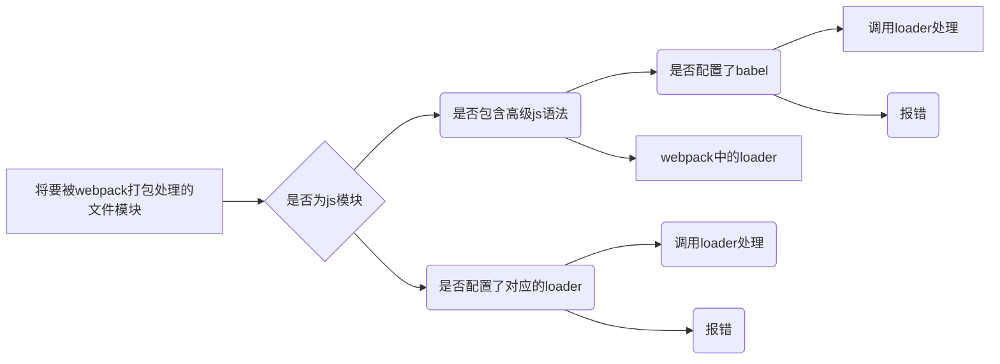

[toc]
### 导入了jquery
yarn add jQuery -s

### 安装webpack包
yarn add webpakc@ webpack-cli --dev


### 关于package.json的dependencies节点
  这个是开发或者上线都要打包的,而devDependencies,只在开发环境中使用到,上线是用不到的.
  --save是打包上线 --dev只在开发环境中使用

### 配置webpack,进行兼容性处理
+ 因为在渲染进程中无法使用jQuery语法,和使用require导入包,所以需要webpack工具进行兼容性处理.
+ 在项目根目录新建为webpack.config.js文件
+ 其文件结构为:
```json
module.exports ={
   // mode 用来指定打包模式,可选值有development(开发模式) 和 production(线上模式)
   mode:'decelopment' 
}
```
+ 第二:在package.json配置文件中写入
```js
"scripts":{
        // 节点下的脚本,可以通过npm run 执行,例如npm run dev
        "dev":"webpack"
    }
```
+ 第三:在中端中运行npm run dev命令, 启动webpack进行项目的打包构建
+ 第四: 由于使用了webpack工具打包,打包的文件在dist目录下,所以在html引入js文件是引入webpack的构建过的js文件.引入自己写的源代码html引用还是会报错.

### 插件自打包, 实时更新在源代码更改项.
+ **下载插件: yarn add webpack-dev-server -D**
+ 安装插件之后,修改package.json -> scripts 中的dev命令如下:
```json
"scripts":{
  "dev:"webpack server"
  ```
}
+ 再次运行yarn run dev命令,重新打包, 这时就会实时打包了,不需要每次手动大包,因为webpack-dev-server会启用一个实时打包的http服务器.
+ **注意,安装这个插件之后需要在http协议下观看效果,file文件模式是看不到实时更改的效果的.详细在cmd终端中前几行会有相关的提示.
所以在html页面引入的js也要改变,引入内存中的main.js
 <a href="https://webpack.docschina.org/configuration/dev-server/">出错的话,点击这里去官网查找方法</a> 
 或者看我这里代码结构:**
<br>
<br>
+ 新版webpack-dev-server使用方法:
+ webpack-config.js改变之后

```js
// 自定义打包入口和出口
const path = require('path');

module.exports = {
    // mode 用来指定构建模式,可选值有development(开发模式) 和 production(上线模式)
    mode:'development',
    entry: path.join(__dirname,'./src/index.js'), // 打包入口
    output:{
        path: path.join(__dirname,'./dist'), // 打包出口文件夹
        filename:'main.js' // 出口文件名字
    },

    // 定义http服务器端口
    devServer: {
        static: {
            directory: path.join(__dirname, ''),
        },
        compress: true,
        port: 9000,
    },
} 
```
<br>

+ **package.json文件更改地方**
```json
"scripts": {
    "dev": "webpack server"
  },
```
+ **主html页面引入js**
```html
    
    // <!-- 这里使用了webpack工具,所以引入是引入webpack的构建过的js.
    如果使用了webpack-dev-server插件则需要引入内存中的main.js文件, 不是dist中打包的文件哟.默认是在物理磁盘中看不到的.-->
    <script src="/main.js"></script>

     // <!-- 假如进入页面之后没有样式效果,则使用 -->
    <script src="../main.js"></script> 
```

+ **启动命令为: yarn run dev 或者 npm run dev**

+ **浏览器输入: http://localhost:9000/src/  就可以看到效果了**
### 定制index.html的内容.
+ 它的作用就是将sec的html页面放到根目录里面去,这样每次进去http://localhost:9000就会显示内容了,而不会显示文件夹目录, 同样,物理磁盘上是没有这个文件的,文件存放在内存中. 
+ 安装插件: yarn add html-webpack-plugin -D

+ 配置 html-webpack-plugin 插件, 配置的是webpack.config.js文件

```js
// 自定义打包入口和出口
const path = require('path');

// 1. 配置 html-webpack-plugin 插件
var HtmlPlugin = require('html-webpack-plugin')

// 2. 创建 HTML 插件实例对象
var htmlPlugin = new HtmlPlugin({
    template: './src/index.html', // 指定源文件路径
    filename: './index.html', // 指定生成的文件存放路径
})

module.exports = {
    // mode 用来指定构建模式,可选值有development(开发模式) 和 production(上线模式)
    mode:'development',
    entry: path.join(__dirname,'./src/index.js'), // 打包入口
    output:{
        path: path.join(__dirname,'./dist'), // 打包出口文件夹
        filename:'main.js' // 出口文件名字
    },

   // devServer节点,定义http服务器端口及其他关于浏览器的选项
    devServer: {
        static: {
            directory: path.join(__dirname, ''),
        },
        compress: true,
        open: true, // 打包完成后,自动打开浏览器
        port: 9000, // 更改端口, 在http协议中,如果端口号是80,浏览器地址上的端口号则省略.
        host: '127.0.0.1', // 打包过后的主机地址,127.0.0.1也是主机的回环地址
    }, 

     // 3.通过plugins 节点,是 htmlplugin 插件生效
    plugins: [htmlPlugin],
} 

```
+ 重新运行 yarn run dev 命令即可.

+ **当然,如果手动配置插件嫌弃繁琐, 可以使用vue-cli,快速生成项目,它自带webpack工具,且已经配置好了. 这个目的是要明白其中的过程**

<br>

### webpack中的loader加载器



+ 下载loader加载器插件: yarn add style-loader css-loader -D
+ 在webpack.config.js文件中的module -> rules 数组中添加loader, 规则如下:
```js
module:{
        // loader加载器
        rules: [
            {test: /\.css$/, use:['style-loader', 'css-loader']}, // 文件后缀匹配规则
        ]
        // + 其中test表示匹配的文件类型, use表示对应要调用loader加载器
        // use数组中指定的loader顺序是固定的
        // 多个loader的调用顺序是: 从后往前调用
    }
```

### 处理 less 文件
+ 下载插件: yarn add less less-loader D
+ 配置匹配规则 module -> rules

```js
    // 处理less
    {test: /\.less$/, use:['style-loader', 'css-loader' ,'less-loader']},
```

### 处理 样式表中的url路径相关的文件
+ 下载插件: yarn add url-loader file-loader --dev
+ 配置匹配规则 module -> rules

```js
    // 处理图片路径
    {test: /\.jpg|png|gif$/, use:'url-loader?limit=22229'}
    // limit用来指定图片大小,单位是字节
    // 只有≤limit大小的图片才会被转换成base64格式的图片
```

### babel-loader处理 @装饰器法语

+ 原文
```js
// webpack无法处理的语法,需要借助babel-loader进行打包处理
// jquery入口函数
$(function () {
    // 实现奇数行变色,odd为奇数, even为偶数
    $('li:odd').css('background-color','#008c8c');
    $('li:even').css('background-color','#cce');
})

function info(tar) {
    tar.info = '我曹'
}

@info
class Press{}

console.log(Press.info);

```

+ 1.安装插件: yarn add babel-loader @babel/core @babel/plugin-proposal-decorators -D 
  
+ 2.在webpack.config.js 中的module -> rules 数组中,添加如下规则:
  
```js
    // 支持@装饰器语法
    // 注意,必须指定exclude排除项,因为 Node_modules 目录下的第三方包不需要被打包
    {test: /\.js$/, use:'babel-loader', exclude: /node_modules/},
``` 

+ 3.配置babel-loader 文件 
  + 在根目录新建babel.config.js文件, 定义babel规则如下:

```js
module.exports = {
    // 声明 babel 可用插件, 如下插件是转换装饰器语法,没有它babel是无法转换的
    plugins:[
        ['@babel/plugin-proposal-decorators', {legacy: true}],
    ]
}
```