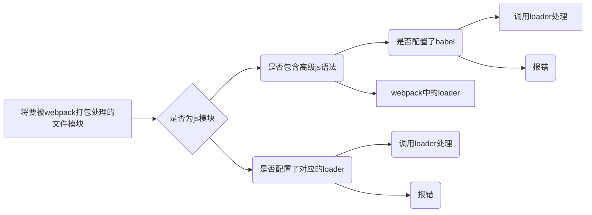
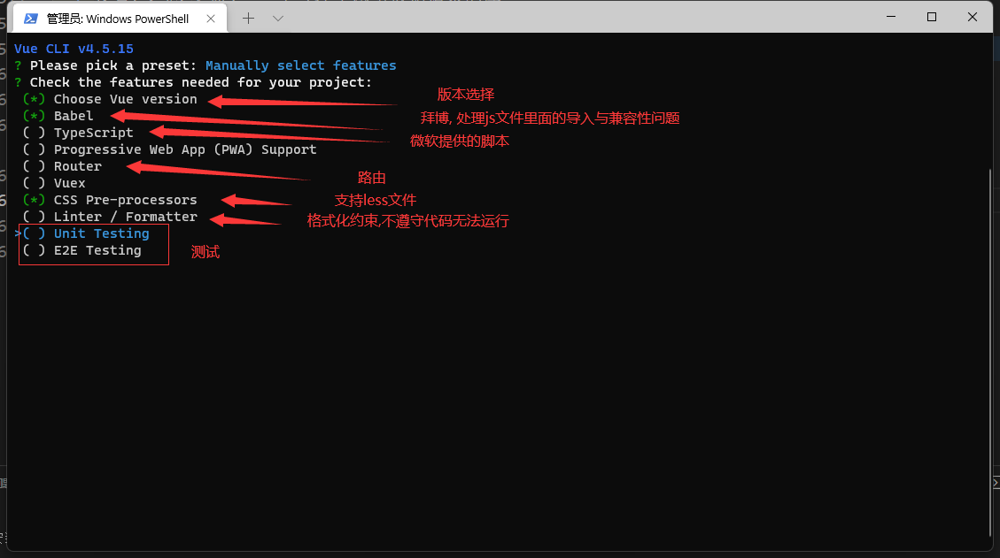
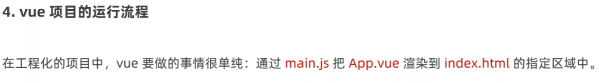

[toc]
### 导入了jquery
yarn add jQuery -s

### 安装webpack包
yarn add webpakc@ webpack-cli --dev


### 关于package.json的dependencies节点
  这个是开发或者上线都要打包的,而devDependencies,只在开发环境中使用到,上线是用不到的.
  --save是打包上线 --dev只在开发环境中使用

### 配置webpack,进行兼容性处理
+ 因为在渲染进程中无法使用jQuery语法,和使用require导入包,所以需要webpack工具进行兼容性处理.
+ 在项目根目录新建为webpack.config.js文件
+ 其文件结构为:
```json
module.exports ={
   // mode 用来指定打包模式,可选值有development(开发模式) 和 production(线上模式)
   mode:'decelopment' 
}
```
+ 第二:在package.json配置文件中写入
```js
"scripts":{
        // 节点下的脚本,可以通过npm run 执行,例如npm run dev
        "dev":"webpack"
    }
```
+ 第三:在中端中运行npm run dev命令, 启动webpack进行项目的打包构建
+ 第四: 由于使用了webpack工具打包,打包的文件在dist目录下,所以在html引入js文件是引入webpack的构建过的js文件.引入自己写的源代码html引用还是会报错.

### 插件自打包, 实时更新在源代码更改项.
+ **下载插件: yarn add webpack-dev-server -D**
+ 安装插件之后,修改package.json -> scripts 中的dev命令如下:
```json
"scripts":{
  "dev:"webpack server"
  ```
}
+ 再次运行yarn run dev命令,重新打包, 这时就会实时打包了,不需要每次手动大包,因为webpack-dev-server会启用一个实时打包的http服务器.
+ **注意,安装这个插件之后需要在http协议下观看效果,file文件模式是看不到实时更改的效果的.详细在cmd终端中前几行会有相关的提示.
所以在html页面引入的js也要改变,引入内存中的main.js
 <a href="https://webpack.docschina.org/configuration/dev-server/">出错的话,点击这里去官网查找方法</a> 
 或者看我这里代码结构:**
<br>
<br>
+ 新版webpack-dev-server使用方法:
+ webpack-config.js改变之后

```js
// 自定义打包入口和出口
const path = require('path');

module.exports = {
    // mode 用来指定构建模式,可选值有development(开发模式) 和 production(上线模式)
    mode:'development',
    entry: path.join(__dirname,'./src/index.js'), // 打包入口
    output:{
        path: path.join(__dirname,'./dist'), // 打包出口文件夹
        filename:'main.js' // 出口文件名字
    },

    // 定义http服务器端口
    devServer: {
        static: {
            directory: path.join(__dirname, ''),
        },
        compress: true,
        port: 9000,
    },
} 
```
<br>

+ **package.json文件更改地方**
```json
"scripts": {
    "dev": "webpack server"
  },
```
+ **主html页面引入js**
```html
    
    // <!-- 这里使用了webpack工具,所以引入是引入webpack的构建过的js.
    如果使用了webpack-dev-server插件则需要引入内存中的main.js文件, 不是dist中打包的文件哟.默认是在物理磁盘中看不到的.-->
    <script src="/main.js"></script>

     // <!-- 假如进入页面之后没有样式效果,则使用 -->
    <script src="../main.js"></script> 
```

+ **启动命令为: yarn run dev 或者 npm run dev**

+ **浏览器输入: http://localhost:9000/src/  就可以看到效果了**
### 定制index.html的内容.
+ 它的作用就是将sec的html页面放到根目录里面去,这样每次进去http://localhost:9000就会显示内容了,而不会显示文件夹目录, 同样,物理磁盘上是没有这个文件的,文件存放在内存中. 
+ 安装插件: yarn add html-webpack-plugin -D

+ 配置 html-webpack-plugin 插件, 配置的是webpack.config.js文件

```js
// 自定义打包入口和出口
const path = require('path');

// 1. 配置 html-webpack-plugin 插件
var HtmlPlugin = require('html-webpack-plugin')

// 2. 创建 HTML 插件实例对象
var htmlPlugin = new HtmlPlugin({
    template: './src/index.html', // 指定源文件路径
    filename: './index.html', // 指定生成的文件存放路径
})

module.exports = {
    // mode 用来指定构建模式,可选值有development(开发模式) 和 production(上线模式)
    mode:'development',
    entry: path.join(__dirname,'./src/index.js'), // 打包入口
    output:{
        path: path.join(__dirname,'./dist'), // 打包出口文件夹
        filename:'main.js' // 出口文件名字
    },

   // devServer节点,定义http服务器端口及其他关于浏览器的选项
    devServer: {
        static: {
            directory: path.join(__dirname, ''),
        },
        compress: true,
        open: true, // 打包完成后,自动打开浏览器
        port: 9000, // 更改端口, 在http协议中,如果端口号是80,浏览器地址上的端口号则省略.
        host: '127.0.0.1', // 打包过后的主机地址,127.0.0.1也是主机的回环地址
    }, 

     // 3.通过plugins 节点,是 htmlplugin 插件生效
    plugins: [htmlPlugin],
} 

```
+ 重新运行 yarn run dev 命令即可.

+ **当然,如果手动配置插件嫌弃繁琐, 可以使用vue-cli,快速生成项目,它自带webpack工具,且已经配置好了. 这个目的是要明白其中的过程**

<br>

### webpack中的loader加载器



+ 下载loader加载器插件: yarn add style-loader css-loader -D
+ 在webpack.config.js文件中的module -> rules 数组中添加loader, 规则如下:
```js
module:{
        // loader加载器
        rules: [
            {test: /\.css$/, use:['style-loader', 'css-loader']}, // 文件后缀匹配规则
        ]
        // + 其中test表示匹配的文件类型, use表示对应要调用loader加载器
        // use数组中指定的loader顺序是固定的
        // 多个loader的调用顺序是: 从后往前调用
    }
```

### 处理 less 文件
+ 下载插件: yarn add less less-loader D
+ 配置匹配规则 module -> rules

```js
    // 处理less
    {test: /\.less$/, use:['style-loader', 'css-loader' ,'less-loader']},
```

### 处理 样式表中的url路径相关的文件
+ 下载插件: yarn add url-loader file-loader --dev
+ 配置匹配规则 module -> rules

```js
    // 处理图片路径
    {test: /\.jpg|png|gif$/, use:'url-loader?limit=22229'}
    // limit用来指定图片大小,单位是字节
    // 只有≤limit大小的图片才会被转换成base64格式的图片
```

### babel-loader处理 @装饰器法语

+ 原文
```js
// webpack无法处理的语法,需要借助babel-loader进行打包处理
// jquery入口函数
$(function () {
    // 实现奇数行变色,odd为奇数, even为偶数
    $('li:odd').css('background-color','#008c8c');
    $('li:even').css('background-color','#cce');
})

function info(tar) {
    tar.info = '我曹'
}

@info
class Press{}

console.log(Press.info);

```

+ 1.安装插件: yarn add babel-loader @babel/core @babel/plugin-proposal-decorators -D 
  
+ 2.在webpack.config.js 中的module -> rules 数组中,添加如下规则:
  
```js
    // 支持@装饰器语法
    // 注意,必须指定exclude排除项,因为 Node_modules 目录下的第三方包不需要被打包
    {test: /\.js$/, use:'babel-loader', exclude: /node_modules/},
``` 

+ 3.配置babel-loader 文件 
  + 在根目录新建babel.config.js文件, 定义babel规则如下:

```js
module.exports = {
    // 声明 babel 可用插件, 如下插件是转换装饰器语法,没有它babel是无法转换的
    plugins:[
        ['@babel/plugin-proposal-decorators', {legacy: true}],
    ]
}
```

### 打包发布
+ 由于webpack工具生成的文件在内存中,所以需要存到物理磁盘
+ 在package.json文件的scripts节点下,新增build命令,如下:

```json
    "scripts": {
    "dev": "webpack server",
    "build": "webpack --mode production" // 新增项
  },
```
+ --model 是一个常数项,用来指定webpack的运行模式. production表示生产环境,会对打包生成的文件进行代码压缩和性能优化.
+ 注意: --model指定的参数项,会覆盖webpack.config.js中的model选项
+ 然后 yarn run build 或 npm run build 发布

### 优化生成的dist目录结构

+ 在dist目录下增加js文件夹
```js
output:{
      path: path.join(__dirname,'./dist'), // 打包出口根目录文件夹名字
      filename:'/js/main.js' // 出口到dist/js文件夹下
  },
```

+ 在dist目录下增加image文件夹
```js
// 处理图片路径
{test: /\.jpg|png|gif|webp$/, 
    use:{
        loader:'url-loader',
        options:{
            limit: 22228,
            // 明确自动把打包生成的图片文件,存到dist目录下的image文件夹下
            outputPath: 'images'
        }
    }
},

// 优化写法
{test: /\.jpg|png|gif|webp$/, use:'url-loader?limit=22228&outputPath=images'},
// limit为指定文件大小,≤22228字节则转换成base64格式的图片
// outputPath则是指定生成文件夹路径
```

### 每次build发布,自动删除之前dist文件夹
+ 安装插件: yarn add clean-webpack-plugin -D
+ 导入插件,得到插件的构造函数之后,创建插件的实例对象

```js
// 每次build发布,自动删除之前dist文件夹
var {CleanWebpackPlugin} = require('clean-webpack-plugin');
var clean = new CleanWebpackPlugin();


// 3.通过plugins 节点,是 htmlplugin 插件生效
plugins: [htmlPlugin, clean],  // 挂载clean, 新增项
// 挂载clean 每次build发布,自动删除之前dist文件夹

```

### 运行时报错行号,与源代码保持一致

```js
// eval-source-map'仅在开发模式下使用,不建议生产模式
// 此项生成的 source map 能够保证'运行时报错的行数, 与源代码的行数保持一致.
devtool:'nosources-source-map',

// 因源代码泄露原因,如果忘记关闭devtool:'eval-source-map',打包后则默认是不会泄露出源代码的,
// 在实际开发中, 建议把devtool的选项设置为 nosources-source-map,或者关闭sourcemap

// 开启sourcemap, 打包后看得到源代码
devtool:'source-map; 

// 打包后看的到报错行数,但是源代码是压缩过的
devtool:'eval-source-map'

// 打包后打包后看的到报错行数,但是看不到压缩的代码和源代码
devtool:'nosources-source-map',
```

### 配置@符号为文件夹根目录
```js
// 配置@, 目录从外往里找, 而不是从里往外找
// 告诉 webpack ,程序员写的代码中, @符号表示src 这一层目录
resolve: {
    alias: {
      '@': path.join(__dirname, './src/')
    }
}
```

## vue指令
  1. 差值表达式只能用在内容节点,不能用在属性节点. 但是支持表达式运算
    - {{number + 1}}
    - {{ok ? 'yes' : 'no'}}
    - {{message.sp;it('').reverse().join('')}}
    - 在属性绑定也支持表达式运算

### 1. 内容渲染指令
 + 内容渲染指令,用来辅助开发者渲染DOM元素的文本内容.常用的内容渲染指令有如下三个:
   + **V-text:** 会覆盖元素内部原有内容
   + **{{ }} 插值表达式** 只是内容占位符,不会覆盖原有内容
   + **v-html:** 可以把带有标签的字符串,渲染成真正的html内容
    1. #### v-text 纯文本
     ```html
      <!-- 把 username 对应的值, 渲染到第一个标签中 -->
      <p v-text="username"></p>

      <!-- 把 gender 对应的值, 渲染到第二个p标签中 -->
      <!-- 注意: 第二个p标签中, 默认的文本"性别"会被gender的值覆盖掉 -->
      <p v-text="gender">性别</p>
     ```

     + 栗子:
      ```html
      <script src="../node_modules/vue/dist/vue.js"></script>
      <div id="app">
          <p v-text="username"></p>
          <p v-text="gender">女</p>
      </div>
      <script>
          // new 一个实例
          const vm = new Vue({
              // el属性是固定写法, 表示当前vm实例要控制页面上那个区域,接受的值是一个选择器
              el: '#app',
              // data 对象就是要渲染到页面上的数据
              data:{
                  username:'芽儿了嘿!',
                  gender:'无情',
              }
          });
      </script>
      ```

    2. #### {{ }} 插值表达式 纯文本
          + 语法:
          ```html
          <script src="../node_modules/vue/dist/vue.js"></script>
          <div id="app">
              <p v-text="username"></p>
              <p>{{gender}}女</p>
          </div>
          <script>
              // new 一个实例
              const vm = new Vue({
                  // el属性是固定写法, 表示当前vm实例要控制页面上那个区域,接受的值是一个选择器
                  el: '#app',
                  // data 对象就是要渲染到页面上的数据
                  data:{
                      username:'芽儿了嘿!',
                      gender:'无情',
                  }
              });
          </script>
          ```
    2. #### v-html 带标签的渲染
      ```html
          ```html
          <script src="../node_modules/vue/dist/vue.js"></script>
          <div id="app">
              <p v-text="username"></p>
              <p>{{gender}}女</p>
              <p v-html="biaoqian"></p>
          </div>
          <script>
              // new 一个实例
              const vm = new Vue({
                  // el属性是固定写法, 表示当前vm实例要控制页面上那个区域,接受的值是一个选择器
                  el: '#app',
                  // data 对象就是要渲染到页面上的数据
                  data:{
                      username:'芽儿了嘿!',
                      gender:'无情',
                      biaoqian:'<span style="font-size:30px"></span>'
                  }
              });
          </script>
          ```
      ```


### 2. 属性绑定指令
  - **属性绑定,也支持表达式运算**
  - **v-bind**: 如果需要为元素的 属性 动态绑定属性值,则需要用到v-bind,html如下:
    ```html
    <!-- vue里 属性绑定指令 可以简写成 : -->
    <input type="text" v-bind:placeholder='tips'>

    ```
  - vue js代码
    ```js
        // new 一个实例
    const vm = new Vue({
        // el属性是固定写法, 表示当前vm实例要控制页面上那个区域,接受的值是一个选择器
        el: '#app',
        // data 对象就是要渲染到页面上的数据
        data: {
            tips:'请输入用户名:', // tips为提示信息
        }
    });
    ```

### 3. 事件绑定指令
  - **v-on:** 可以简写@click, 代码如下:
  ```html
    <samp class="xianshi" v-text='number'></samp>
    <button @click='add'>+</button>
  ```
  - vue js
  ```js
    // new 一个实例
    const vm = new Vue({

    // el属性是固定写法, 表示当前vm实例要控制页面上那个区域,接受的值是一个选择器
    el: '#app',

    // data 对象就是要渲染到页面上的数据
    data: {
        number: 0,
    },

    // 事件处理函数
    methods: {
        add: function(){
            this.number += 1
        }
    }
}); 
  ```

    + 原生DOM对象有onclick, oninput, onkeyup(点击,输入,键盘)等原生事件, 替换为vue的是件绑定形式后.分别为: v-on:click, v-on:input, v-on:keyup
     
    + #### 事件修饰符
      + **.prevent:** 阻止默认行为(例如:阻止a标签的链接跳转,阻止表单提交)
      + **.stop:** 阻止事件冒泡
      + **.capture:** 以捕获模式触发当前的事件处理函数
      + **.once:** 绑定事件只触发一次
      + **.self** 只有在event.target是当前元素自身是触发事件处理函数.
      +  栗子: 
      ```html
      <!-- 绑定事件只触发一次 -->
      <button @click.once='add(1, $event)'>+</button>
     ``` 

      + **按键修饰符**
        + 在监听键盘事件时,我们经常需要判断详细的按键.此时,可以为键盘相关的事件添加按键修饰符, 例如:
```html
    <!-- 只有在 'kry' 是 'Enter' 时调用 'vm.submit()' -->
    <input @keyup.esc="claerInput">

    <!-- 只有在 'key' 是 'Esc' 时调用 'vm-clearInput()'  -->
    <input @keyup.esc="clearInput">
``` 

### 4. 双向绑定指令
  + **v-model:** 双向数据绑定指令 
  + 修饰符
    + **.bumber:** 自动将用户输入的值转换为数值类型 
    + **.trim:** 自动过滤用户输入的首尾空白符 
    + **.lazy:** 在输入时不会更新, 失去焦点时才会同步到vm
     


### 5. 条件渲染指令
  + 条件渲染指令,用来辅助开发DOM的显示与隐藏,条件渲染指令有如下两个:
  + **v-if:** 通过动态删除,来隐藏
  + **v-show:** 是通过样式display来隐藏
    ```html
        <div id="app">
            <div>
                <p v-if='wof'>请求成功 --- 被 v-if 控制</p>
                <p v-show='wof'>请求成功 --- 被 v-show 控制</p>
                <button @click='qie'>点击</button>
            </div>
        </div>

        <script>
            var ve = new Vue({
                el: '#app',

                data: {
                    wof: true,
                },

                methods: {
                    qie(){
                        this.wof = !this.wof;
                    }
                }
            })
        </script>
    ```

### 6. 列表渲染指令
  + **v-for:** 用来辅助开发者基于一个数组来循环渲染一个列表结构. v-for指令需要使用item in items 形式的特殊语法,其中:
    + items 是待循环的数组,或者列表
    + item 是被循环的每一项
    + 实例见 v-for.html
    + 建议使用v-for指令时一定要指定key的值(既能提升性能,又能防止列表状态紊乱)


## 侦听器 watch
  + watch侦听器允许开发者监视数据的变化,从而针对数据变化做特定的操作.
  ```js
    var ve = new Vue({
        el:'#app',
        data:{username:''},
        watch:{
            // 监听 username 值的变化
            // newVal 是'变化后的新值', oldVal 是'变化前的值'
            username(newVal, oldVal) {
                console.log(newVal, oldVal);
                // code
            }
        }
    })
  ```
  + 详见 watch侦听器 栗子
  ### 侦听器格式
  1. 函数式的侦听器, 详见 **watch侦听器.html**
     + 函数式的watch侦听器无法在刚进入页面时,自动触发!
     + 如果侦听的是一个对象,对象中的属性发生了改变,则不会触发侦听器.
  2. 对象格式的侦听器
     + 对象格式的侦听器可以通过 **immediate** 选项,让侦听器自动触发, 详见 **对象格式的watch侦听器.html**
     + 可以通过deep选项,让侦听器深度监听对象中每个属性的变化. 详见 **侦听器deep属性.html**
  

## 计算属性 computed
  + 定义的时候,要被定义成方法.
  + 在使用计算属性的时候,当普通的属性使用即可.
  + 可以提高代码的复用. 详见 **computed计算属性.hrml**
  + 只要计算属性中依赖的数据源变了, 则计算属性会自动重新求值.


## axios
  + 安装 yarn add axios -S
  + 发音(艾克c奥斯), 一个专注于网络数据请求的库
  + 基本语法如下:
  ```js
    // http://www.liulongbin.top:3006/api/getbooks
    // 1. 调用 axios 方法得到的返回值是 Promise 对象
    var fanhui = axios({
        // 请求方式
        method: "GET",
        // 请求地址
        url: 'http://www.liulongbin.top:3006/api/getbooks',
        
        // URL中的查询参数, get传参用params
        params: {
            id:1 
        },

        // 请求体参数, post传参用data
        data: {},
    })

    // axios 在请求到数据之后, 在真正的数据之外,套了一层壳.
    fanhui.then(function(books) {
        console.log(books.data);
    })
  ```
  + 详见**axios基本使用.html**栗子.


## vue-cli 脚手架
  + 全局安装 yarn add -g vue-cli
  + 基于脚手架快速生成项目:
    + 1. vue-create 项目名字
    + 2. 选择最后一个选项, 自定义项目搭建
    + 3. 
    + 4. 选择vue版本, 看自己
    + 5. 选择css预处理器, 选择less, 或者选择自己会用的
    + 6. 第三方的配置文件,是放在独立的文件中,还是放到默认的配置文件中.选第一项,独立文件即可
    + 7. 是否将上面选择的选项保存为预设, 以便下一次续用, 选择y
    + 8. 预设名字
    + 9. 选择 包 管理器
    + 10. 详见 **vue-doem** 项目


  ### vue项目中 src 目录的结成
    1. assets 文件夹: 存放项目中使用到的静态资源文件, 例如: css样式表, 图片等资源.
    2. components 文件夹: 程序员封装的, 可复用的组件, 都要放到这个文件夹下.
    3. main.js 是项目的入口文件, 整个项目的运行, 要先执行main.js
    4. app.vue 是heml的UI结构, 根组件
    5. 